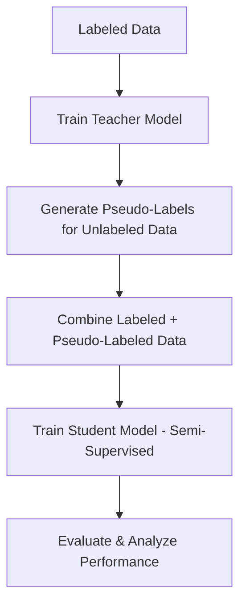

# 🧠 Semi-Supervised Semantic Segmentation


This project implements a **complete semi-supervised semantic segmentation pipeline** using **DeepLabV3-ResNet50** in **PyTorch**, trained on the **Pascal VOC 2012** dataset.  
It leverages both labeled and unlabeled data through **pseudo-labeling** to reduce dependency on costly manual annotations while maintaining strong segmentation performance.

---

## 📌 Key Features

- **Teacher–Student Training Pipeline:**  
  Train a teacher model on labeled data, generate pseudo-labels, and retrain a student model with both datasets.

- **Pseudo-Label Generation:**  
  Automatically produce pixel-level labels for unlabeled data using the teacher network.

- **Fully Modular Implementation:**  
  Includes dataset preparation, pseudo-labeling, training, and evaluation scripts — all self-contained and reproducible.

- **Quantitative Evaluation:**  
  Computes **Pixel Accuracy**, **Mean IoU**, and **Per-Class IoU** metrics for detailed analysis.

- **Reproducible Research Setup:**  
  Entirely implemented in **Python 3.13 + PyTorch**, with clear directory structure and logging.

---


## 🚀 Training Pipeline Overview



---

## 🧪 Steps to Reproduce

### 1️⃣ Train the Teacher Model (Supervised)

```bash
python train_teacher.py
```

Trains DeepLabV3-ResNet50 on the labeled subset of Pascal VOC 2012.

---

### 2️⃣ Generate Pseudo-Labels

```bash
python generate_pseudo_labels.py
```

Uses the trained teacher model to infer pseudo-labels for unlabeled images.

---

### 3️⃣ Train the Student Model (Semi-Supervised)

```bash
python train_student.py
```

Trains a student model using both labeled and pseudo-labeled data.  
This step may take several hours depending on your hardware.

---

### 4️⃣ Evaluate the Model

```bash
python evaluate_student_metrics_full.py
```

Computes pixel accuracy, mean IoU, and per-class IoU.  
Outputs are stored in `results_student_full_eval/`.

---

## 📊 Quantitative Results

| Model | Pixel Accuracy (%) | Mean IoU (%) |
|-------|-------------------|--------------|
| Teacher (Supervised) | 80.27 | 22.83 |
| **Student (Semi-Supervised)** | **83.04** | **25.18** |

### Per-Class IoU Example:

| Class | IoU (%) |
|-------|---------|
| background | 76.69 |
| aeroplane | 35.90 |
| bus | 51.47 |
| car | 25.50 |
| person | 23.70 |

📈 *Semi-supervised training improved both overall pixel accuracy and mIoU, confirming the effectiveness of pseudo-labeling.*

---

## 🧠 Key Insights

- Pseudo-labeling helps extract valuable supervision from unlabeled data.
- The model learns stronger object boundaries and better generalization.
- Larger and distinct classes (e.g., vehicles) benefit the most.
- Small, irregular, or low-contrast objects (e.g., chairs, plants) remain challenging.

---

## 🛠️ Installation

```bash
# Clone the repository
git clone https://github.com/youcefgheffari3/semi-supervised_segmentation.git
cd semi-supervised_segmentation

# Create a virtual environment
python -m venv venv
source venv/bin/activate  # On Linux/Mac
# OR
venv\Scripts\activate  # On Windows

# Install dependencies
pip install -r requirements.txt
```

**Recommended Python version:** 3.13  
**Framework:** PyTorch ≥ 2.3.0  
**Dataset:** Pascal VOC 2012

---

## 📁 Dataset Setup

Download the official Pascal VOC 2012 dataset:

```bash
wget http://host.robots.ox.ac.uk/pascal/VOC/voc2012/VOCtrainval_11-May-2012.tar
tar -xvf VOCtrainval_11-May-2012.tar
```

Then place the folders inside `datasets/` as follows:

```
datasets/
├── VOC2012_train_val/
└── VOC2012_test/
```

---

## ⚙️ Requirements

- Python ≥ 3.10
- PyTorch ≥ 2.3.0
- Torchvision ≥ 0.18
- NumPy
- Matplotlib
- OpenCV
- tqdm

All dependencies are listed in `requirements.txt`.

---

## 📈 Visualizations

### 1️⃣ Training Pipeline


### 2️⃣ Per-Class IoU Bar Plot


### 3️⃣ Qualitative Results


---

## 🙏 Acknowledgments

Special thanks to the authors of the paper:  
**"Semi-Supervised Semantic Image Segmentation with Self-Correcting Networks"**  
Mostafa S. Ibrahim, Arash Vahdat, Mani Ranjbar, and William G. Macready.  
Their work inspired the conceptual foundation of this implementation.

---

## 📧 Contact

**Author:** Gheffari Youcef Soufiane  
**Institution:** University of Science and Technology of Oran Mohamed-Boudiaf (USTOMB)  
**Email:** [youcefgheffari3@gmail.com](mailto:youcefgheffari3@gmail.com)  
**GitHub:** [@youcefgheffari3](https://github.com/youcefgheffari3)

---

## 🏷️ Topics

`semantic-segmentation` • `pseudo-labeling` • `semi-supervised-learning` • `deeplabv3` • `pytorch` • `computer-vision` • `pascal-voc` • `deep-learning`

---

## 📄 License

This project is licensed under the MIT License - see the [LICENSE](LICENSE) file for details.

---

<div align="center">

**⭐ If you find this project helpful, please consider giving it a star! ⭐**

Made with ❤️ by [Youcef Soufiane Gheffari](https://github.com/youcefgheffari3)

</div>
